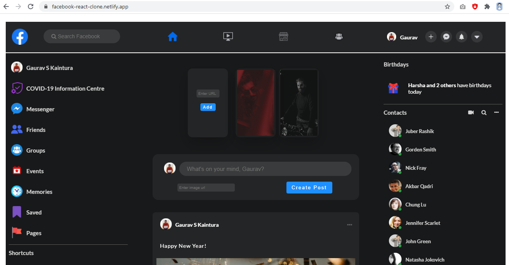

# fb-react-clone
fb-home-page react clone

### Live on Netlify:
https://facebook-react-clone.netlify.app/

### Source Code:

Available in the *master* branch

### Concepts Used:
- React Class Components
- React Lifecycle Methods (componentDidMount, componentDidUpdate)
- Custom API
- React LocalStorage Concepts
- Controlled Forms
- Passing State data in Child components

### Day 1 (23 Dec 2020 - Wednesday):

- Started working on the new assignment
- Designed a rough sketch of the designs given to me in my own way
- Segregated whole application idea into different components I can design and use individually

#### Sketch

### Day 2 (24 Dec 2020 - Thursday):

### Day 3 (26 Dec 2020 - Saturday):

### Last Update:

